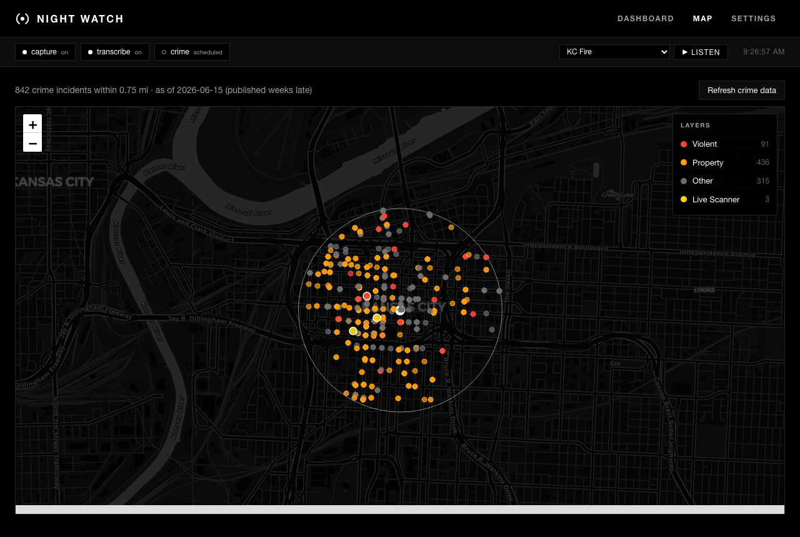
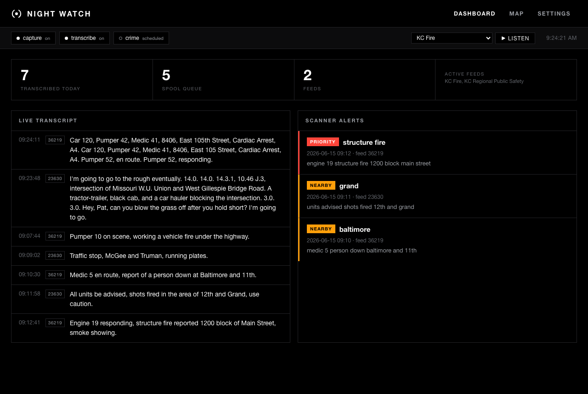
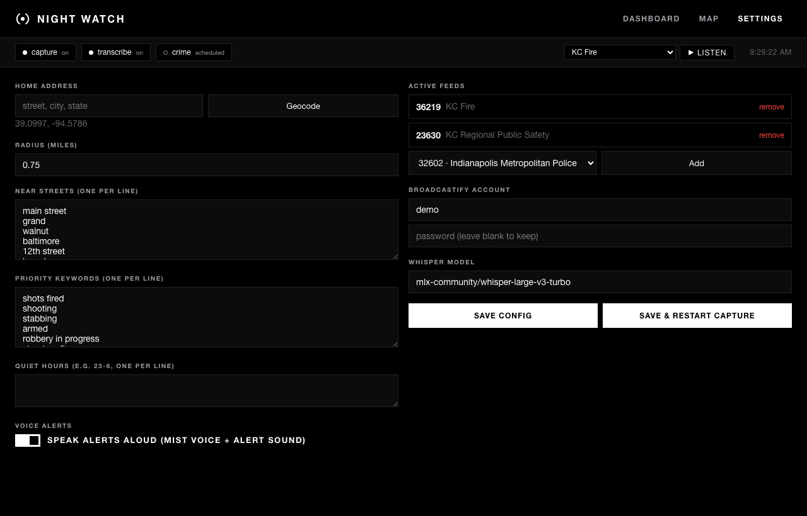

# Night Watch

A two-layer neighborhood safety feed for Kansas City, built because no clean,
legal, real-time, geocoded "what's happening near me" feed exists off the shelf
(Citizen is a closed ToS-violating scrape; PulsePoint locked its API behind a
login in June 2026; KC's open crime data is geocoded but published weeks late).

So Night Watch combines the two halves that *are* available legitimately:

| Layer | Source | Nature |
|---|---|---|
| **Context** | KC Open Data (KCPD), Socrata API | Official, geocoded, but **multi-week lag**. Weekly digest of crime near home. |
| **Real-time** | Broadcastify live scanner feed + local transcription | Live dispatch audio, transcribed on-device with mlx-whisper, matched for near-home streets and priority incidents. |

The context layer keeps it honest and grounded; the scanner layer is the actual
"alert me now" capability. Neither depends on a service that can revoke access
or a ToS we're violating.



*The map: crime pins by type, optional live CAD, and live scanner incidents
geocoded from alerts, all toggleable from the Layers panel. (Screenshots use a
generic downtown location and demo data.)*

## How it works

```
crime_pull.py     KC Socrata  ──►  "Neighborhood Watch.md"  (weekly)
scanner_capture.py   Broadcastify ──► spool/*.wav  (rolling 30s segments)
scanner_transcribe.py  spool/ ──► mlx-whisper ──► match ──► mist-notify + "Scanner Alerts.md"
```

- Capture holds one ffmpeg connection to the feed and writes 16 kHz mono WAV
  segments. It auto-reconnects on drops.
- Transcribe gates out dead air (RMS energy) so Whisper doesn't hallucinate on
  silence, transcribes real traffic locally, and matches each line against your
  `near_streets` and `priority_keywords`.
- Matches are spoken via MIST (`mist-notify`) and appended to a vault note.
  Rate-limited to one alert per reason per 10 minutes; silent during quiet hours.

## Setup

You need two things, both kept out of git:

1. **`config.json`** — copy `config.example.json` to `config.json` and fill in:
   - `home.lat` / `home.lng` — your home coordinates (look up your address on
     any map, right-click → coordinates). Drives the radius filter. **Never
     committed.**
   - `radius_miles` — how close counts as "near home" (0.75 is a good start).
   - `alerts.near_streets` — lowercased street names in/around your radius. These
     are what get matched against spoken dispatch audio. The more complete, the
     better the geo-filtering.
   - `scanner.username` / `scanner.password` — a **free** Broadcastify account.
     Needed because free live feeds are account-gated. *Or* paste a
     `scanner.stream_url_override` grabbed from the logged-in web player's
     Network tab (more reliable; URLs can rotate).

2. **Python venv** (transcriber only):
   ```sh
   python3 -m venv .venv && .venv/bin/pip install mlx-whisper
   ```
   The model downloads on first run and caches.

3. **Optional:** `brew install terminal-notifier` so alert notifications are
   clickable and open the app (otherwise a native notification is used).

### Run it

```sh
# context layer — try it immediately, no account needed:
python3 crime_pull.py

# scanner layer (after config.json has Broadcastify creds):
python3 scanner_capture.py        # terminal 1
.venv/bin/python scanner_transcribe.py   # terminal 2
```

### Desktop GUI

A full-featured control panel (`app.py`, Flask + pywebview, http://127.0.0.1:5018):

- **Dashboard** — service health pills (click to start/stop), live transcript
  stream (feed-tagged), scanner alerts, counters, and a **Listen** control to tune
  into any configured feed's live audio in-app (streamed via the backend).



- **Map** — Leaflet map with your home marker and radius ring. A **Layers**
  panel (top-right) toggles each layer on/off: crime pins by type (violent /
  property / other), the optional **Live CAD** layer, and the **Live Scanner**
  layer — incidents geocoded (approximately) from scanner alerts that drop onto
  the map as they're heard and refresh every ~10s. Crime pins note their publish
  lag; scanner pins are marked approximate.
- **Settings** — geocode your address, set radius, add/remove feeds from the live
  KC directory, edit near-streets / priority keywords / quiet hours, toggle voice
  alerts, manage the Broadcastify login. Save and optionally restart capture in
  one click.



Launch from `~/Desktop/Apps/Night Watch.app`, or `.venv/bin/python app.py`.

### Run it as services (launchd)

```sh
./install.sh
```

This fills the `launchd/*.plist.template` files in for your checkout, writes real
plists to `~/Library/LaunchAgents`, and loads them. `com.nightwatch.crime` runs
weekly; `com.nightwatch.capture` and `com.nightwatch.transcribe` are KeepAlive
and run continuously. (The templates use placeholders rather than hardcoded
paths, so nothing personal is committed.)

## Privacy

Your home coordinates, street list, Broadcastify credentials, captured audio, and
transcripts all live in gitignored paths (`config.json`, `spool/`, `data/`,
`logs/`, `notify-*.sh`). Only `config.example.json` (generic placeholder coords)
is committed. The launchd plists are placeholder templates filled in at install
time, so no machine-specific paths are committed either.

## Use in another city

Nothing here is hardcoded to Kansas City beyond the example config:

- **Crime layer** — works with any city's Socrata open-data portal. In
  `config.json` set `crime.domain` and `crime.incidents_dataset` to that city's
  crime dataset, and map `crime.fields` to its column names (the date, offense,
  address, and location-point columns). Most large US cities publish a Socrata
  crime dataset; some use ArcGIS instead (a small fetch tweak).
- **Scanner layer** — Broadcastify covers most of the US (and beyond). Set
  `scanner.directory_url` to your metro/county listing page and pick feeds from
  it in the GUI. Capture and transcription are location-agnostic.
- **Alerts** — `home`, `radius_miles`, and `near_streets` are all config.

### Real-time CAD layer

Where a city publishes a genuinely live calls-for-service feed, Night Watch can
pull it as a near-real-time layer (separate from the lagging crime data). Enable
it under `cad` in `config.json`: set `enabled`, point `domain` /
`incidents_dataset` at the live dataset, and map `fields` to its columns
(`config.example.json` ships a working **Seattle** example). It polls every 15
minutes (`com.nightwatch.cad`), shows as the **Live CAD** map layer, and with
`cad.alert: true` notifies on genuinely new calls near home (deduped by id). KC's
own CAD lags, so it's off by default here.

### Other data sources worth adding

The same "near home, real-time, on-device" pattern extends to other free, official
feeds (good contributions):

- **NWS weather alerts** (`api.weather.gov/alerts`) — free, no auth, nationwide
  real-time severe-weather/emergency alerts by point. High value, easy add.
- **USGS earthquakes** — free real-time GeoJSON feeds.
- **NASA FIRMS / Watch Duty** — wildfire detection (Watch Duty is West-US).
- **State 511 / Open511** — traffic incidents and road closures.

## Responsible use

This is built for **personal, local** situational awareness. It captures a free
public Broadcastify stream to your own machine and transcribes it on-device. Use
it within Broadcastify's Terms of Service: don't rebroadcast or redistribute the
audio, and don't republish transcripts. It reads only **public** open-data and
public-safety radio. The transcription is imperfect; never treat an alert as a
verified fact or act on it as if it were dispatched to you.

## Cost

$0 as configured. Free Broadcastify account, on-device transcription. Broadcastify
Premium ($30/yr) would only add ad-free streaming and 365-day archive backfill
for overnight gaps — optional, add it only if the feed proves its worth.

## Honest limitations

- **Context layer lags weeks.** KC publishes crime data late. It's for patterns,
  not "right now." The note self-labels how far behind it is.
- **Scanner geo-filtering is good, not perfect.** Dispatchers speak addresses;
  matching spoken street names from noisy, jargon-heavy audio will miss some and
  false-positive on others. Tune `near_streets` and `SILENCE_RMS` over time.
- **Capture needs the Mac awake.** Overnight sleep = gaps (Premium archive could
  backfill, not wired up).
